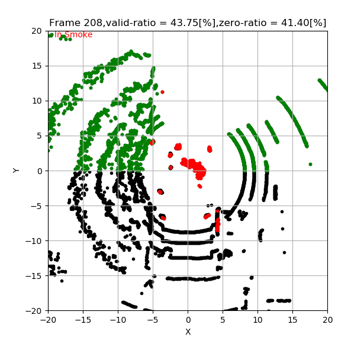

# LiDAR Smoke Judge

LiDARでの霧検出用のスクリプト

scripts/LidarSmokeJudge.py に `LidarSmokeJudge`とテストコードを記載。
- is_in_smoke: 霧の中にいるか判定する
- smoke_filter: 霧の可能性がある点群にフラグを立てる

# Usage

## pacpデータを変換
pcapデータをダウンロード。

veloparserで任意のデータをtxtファイル化。
※ pcapから直接読み込みは未実装。今後実装したい。

```
$ git clone https://github.com/ArashJavan/veloparser.git
```

```
$ cd veloparser
$ python main.py -p {smoke.pcap} -o {out_data} -c params.yaml
```

{out_data}直下にフレームごとに点群のファイルが生成される。
asciiのファイルは、例えば下記のように点群の情報が保存されている。
```
# time,X,Y,Z,id,intensity,distance
2062572005,-0.117579,-8.748566,-2.333183,0,9,9.058
2062572009,-0.140492,-10.231870,-2.352736,2,10,10.502
2062572014,-0.173163,-12.349619,-2.392659,4,12,12.582
2062572023,-0.283024,-19.380375,-2.374765,8,19,19.528
...
```

## Sample Data

'sampledata/data_ascii'直下にサンプルデータを追加しています。


## LiDARSmokeJudgeの実行

plot_LiDARSmokeJudge.py の下記を任意のディレクトリ、フレーム数として実行

```python
if __name__ == "__main__":
    # データが保存されているディレクトリのパス
    data_dir = '../data/smoke/velodynevlp16/data_ascii'
    start_frame = 180
    end_frame = 250
    visualizer = LiDARVisualizer(data_dir, start_frame, end_frame)
    visualizer.visualize_frames()
```

```
$ python .\plot_LiDARSmokeJudge.py
```
以下のようなグラフが出力されるはず。
